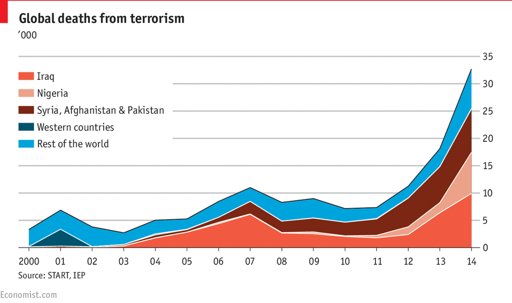

### Goals:

1.  Fulfill Math Camp Project Promise #1 by recreating a real plot from The Economist.
2.  Practice advanced data visualization with `ggplot2`.
3.  Dive into advanced visualization options with `scale()` functions.

### Math Camp Project Promise #1b: The Economist Visualization

Today, we will continue working on recreating the plot from The Economist in [this article](https://www.economist.com/graphic-detail/2015/11/18/the-plague-of-global-terrorism) that we promised at the beginning of Math Camp. This exercise is adapted from a wonderful tutorial by [Tanesya Tresna](https://rpubs.com/tangerine/economist-plot).



### Question 1

Now that we have already performed most of the necessary data manipulation to create this visualization, let's pick up where we left off last time. Please load the `tidyverse` library and use the `readRDS()` function to read the two datasets you stored from last time - `econ_sum.rds` and `total.rds`.

```{r}
library(tidyverse)

econ_sum <- readRDS("data/econ_sum.rds")
total <- readRDS("data/total.rds")
```

### Question 2

Finally, find the unique values of `region` in your `econ_sum` dataset and remove rows with the one region that does not appear in the plot above (**Hint**: don't forget `!=`). Then, use the `as.factor()` function on region to mutate that column into a factor class.

```{r}
econ_sum <- econ_sum %>% 
  filter(region != "Others") %>% 
  mutate(region = as.factor(region))
```

### Question 3

The Economist plot uses a new geom we have not used before, `geom_area()`. But it uses the same syntax as all of our geometries. Create a simple `ggplot()` with `econ_sum` using `iyear` as your x-aesthetic, `deaths` as your y, and `fill` by region. Also try to replicate the labels in the final plot (title, subtitle, and caption).

```{r}
ggplot(econ_sum, aes(iyear, deaths, fill = region)) +
  geom_area(color = "white") +
  labs(title = "Global deaths from terrorism",
       subtitle = "'000",
       caption = "Source: START, IEP",
       x = NULL,
       y = NULL)
```

### Question 4

One very useful ability of `ggplot()` that we have not used yet is the ability to simultaneously [plot data from multiple datasets.]{.underline} Let's try that here. Copy your code from the previous question. After your first `ggplot()` line, but before your existing `geom_area()`, add another call to `geom_area()` that uses the `data` argument and sets it equal to `total`.

Once you've gotten this working, try changing the order of your now two calls to `geom_area()`. What do you notice?

Once you are happy with your plot, save the whole thing to an object called `p`. Yes, you can save `ggplot()` plots as objects!

```{r}
p <- ggplot(econ_sum, aes(iyear, deaths, fill = region)) +
  geom_area(data = total) +
  geom_area(color = "white") +
  labs(title = "Global deaths from terrorism",
       subtitle = "'000",
       caption = "Source: START, IEP",
       x = NULL,
       y = NULL)

p
```

### Question 5

One enormous strength of `ggplot()` is that figures are near infinitely customizable. While making plots, `ggplot()` will often choose sensible defaults for you (on things like font sizes, the values that appear on your axes, legend titles, etc.), but you have the ability to overwrite nearly any aspect of a plot you create. During the course of the semester, we will learn many of these options. Two powerful sources of customization come from the series of `scale()` functions and the `theme()` functions.

Every source of aesthetic information on your plot (e.g. color, size, axes, etc.) is controlled by what `ggplot()` refers to as a "scale." There are individual functions for controlling each scale (to see just how many, go to your Console and search the documentation for all functions that start with `scale_` in the `ggplot2` package by running `??ggplot2::scale_`).

Despite their incredible number, thankfully scale functions can be quite intuitive. For example, because we used `fill = region` in our code above, we can manually edit the colors set by fill with the `scale_fill_manual()` function. This function, appropriately named, allows us to manually specify colors to the fill "scale" instead of the default `ggplot2` colors.

Colors in large publications like The Economist are generally set by a design team that create design guidelines. For example, [here](https://design-system.economist.com/foundations/principles/design-principles#our-principles) is the official design principles document for The Economist. In our case, there are 5 colors set by fill on the plot (one for each region). These colors are Hex codes like we've previously learned, and are `"#7b2713"`, `"#eb9e84"`, `"#00a4dc"`, `"#f15a40"`, and `"#00526d"`. To put these on our plot, create a vector with `c()` that has these five Hex codes as values, and pass it to the `values` argument of `scale_fill_manual()`.

**Hint**: Just like before, you can add additional options to your `ggplot` with `+`. Since you've already created a plot object `p`, you can do this by simply putting `p + scale_fill_manual(values = your_vector)`.

```{r}
p + 
  scale_fill_manual(values = c("#7b2713","#eb9e84","#00a4dc","#f15a40","#00526d"))
```

### Optional: Question 6

We will learn many other customization options throughout the course of the semester. You will learn these in time, so please do not be overwhelmed by the many, many customization options available to you through `ggplot2`. We encourage you to read function documentation or even the official `ggplot2` according to your time and interest, though this is not required and fully optional. To finish the specific customization code used in this plot, you can run the following code below. Try reading through it to understand what is going on, though more of this will make sense during the course of the semester!

```{r}
p + scale_fill_manual(values = c("#7b2713","#eb9e84","#00a4dc","#f15a40","#00526d")) + 
  scale_x_continuous(breaks = seq(2000, 2014),
                     labels = c(2000, paste0(0, seq(1,9)), seq(10,14)))+
  scale_y_continuous(position = "right",
                     breaks = seq(0,125,125/7),
                     labels = paste(seq(0,35,5))) + 
  theme(aspect.ratio = 3.2/7,
        panel.background = element_rect(fill = "white"),
        panel.grid.major.x = element_blank(),
        panel.grid.major.y = element_line(color = "darkgrey"),
        legend.text = element_text(margin = margin(l=3), size = 10),
        legend.title = element_blank(),
        legend.position = c(0.16,0.7),
        axis.text = element_text(size = rel(1), color = "gray8"),
        axis.line.x  = element_line(color = "gray8"),
        axis.ticks.y = element_blank(),
        plot.title = element_text(size = rel(1.5), hjust = 0, face = "bold"),
        plot.caption = element_text(hjust = 0, size = 9))
```
