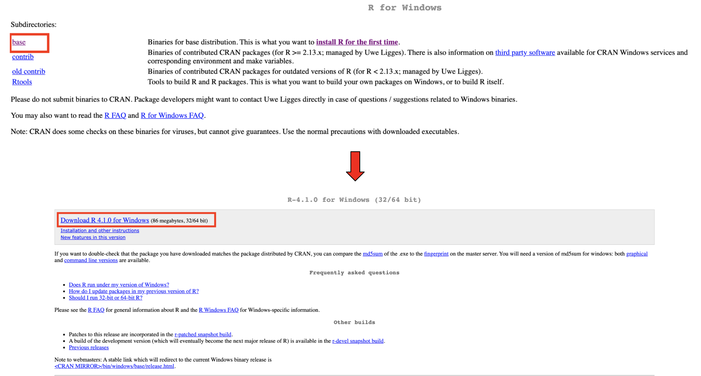

```{r setup, include=FALSE, message=FALSE}
knitr::opts_chunk$set(echo = TRUE)
library(tidyverse)
```

# Installing the Tools of Data Science

For this course, you will need to install some free and safe software. This document will walk you through installing the tools we will be using in this course. 

---

# Installing R

First, we will install a programming language called `R`. This is the tool we will be using throughout the course to analyze data and make plots.

R is a **programming** language that will help you do useful things with data. R looks like this - although it looks like nonsense to you right now, this will make sense very soon! You can try to read through this code below to get a sense of what it might be doing (I'll put the answer at the very end of this document).

```{r, eval=FALSE}
population %>%
  group_by(country) %>%
  summarise(avg_population = mean(population))
```

To install R, go to [this link](https://cran.r-project.org/): https://cran.r-project.org/ (you may need to copy and paste the link into the URL bar of your browser)

On this website, go to the section in the red box below and click on the type of your computer (probably either Windows or Mac).

```{r, echo=FALSE, fig.align="center", fig.cap="***Choose Mac or PC depending on what kind of computer you have.***"}
knitr::include_graphics("../figs/l0_CRAN.png")
```

If you have a Mac, click on the first `.pkg` link (in the red box below). This will download a file. Open it and follow the instructions to install it like you would any other program.

```{r, echo=FALSE, fig.align="center", fig.cap="***If you have a Mac, this screen will look like this.***"}

```

If you have a Windows computer, first click on **base** and then *Download R 4.1.0 for Windows* (in the red boxes below).

```{r, echo=FALSE, fig.align="center", fig.cap="***If you have a Windows PC, this screen will look like this.***"}

```

---

# Installing RStudio

Once that is done, now we need to install a program called **RStudio**. This is an application that will allow you to interact with the programming language R. RStudio is useful because it will let you see your code, data, plots, and everything else all in one place.

```{r, echo=FALSE, fig.align="center", fig.cap="***RStudio will help put your data, code, and plots all in one place.***"}

```

To install RStudio, go to [this link](https://rstudio.com/products/rstudio): https://rstudio.com/products/rstudio/ (you may need to copy and paste the link into the URL bar of your browser)

Once there, follow the picture below to: 

1. Click on **Download Rstudio Desktop**
2. Select the **Free** version.
3. Download RStudio for your computer.

Click on the downloaded file and follow the instructions to install RStudio.

```{r, echo=FALSE, fig.align="center", fig.cap="***Follow this process to download RStudio.***"}
knitr::include_graphics("../figs/l0_rstudio.png")
```

Congratulations! You've installed all of the necessary materials for this course.

# Using RStudio

When you open the RStudio proggam for the first time, it will look something like this:

```{r, echo=FALSE, fig.align="center", fig.cap="***RStudio: Your new best friend for the next several weeks!***"}
knitr::include_graphics("../figs/l0_blank.png")
```

There are different sections of RStudio, as described below and shown in the picture:

- **Console**: this is where your code will be evaluated.
- **Environment**: this tells you useful things about your code, like which datasets you are using.
- **Tools**: this section will change depending on what you ask RStudio to show you. For example, plots will show up here.

```{r, echo=FALSE, fig.align="center"}

```

Let's try to evaluate some code. In the `>` part of the console, try typing in `2 + 7` like this and press **Enter** (or return depending on your computer):

```{r, echo=FALSE, fig.align="center"}

```

Awesome! If that code evaluated to `9`, your installation is working.

# Creating a place to store your code

Often, you will want to save your work for later. No code in the console will be saved the next time you open RStudio. If you want to save your work, you need to store it in a file. There are files that will save only code, but it is convenient to save your writing, code, and outputs like plots and figures all in one place. 

This is what **RMarkdown** is for. An RMarkdown file is a document just like Microsoft Word or Google Docs. If you want to save your work, you need to make a document and save.

Let's make an RMarkdown file by going to `File --> New File --> R Markdown` like in the picture below:

```{r, echo=FALSE, fig.align="center"}
knitr::include_graphics("../figs/l0_new_markdown.png")
```

A window like this should appear - please give it any title you like, make sure HTML is selected, and press **OK**.

```{r, echo=FALSE, fig.align="center"}

```

Now go to `File --> Save` (or press CMD + S on Mac / Ctrl + S on PC), give your file a name (something like `day1.Rmd` is fine!), and save it. It would be a good idea to create a new folder on your computer for this course and save it there.

There is some setup code there that you don't need. Go ahead and delete everything after the `---`. Then, click on the green **Insert** button, select R, and you will see a **chunk**. You can add code here in the dark gray area. Write something simple like 2 + 2:

```{r, echo=FALSE, fig.align="center"}

```

To run your code, you can click on the `Knit` button with the blue yarn to run your code. You should see a new window appear like this with your finished code:

```{r, echo=FALSE, fig.align="center"}

```

# Packages

R has many free add-ons that you can use to access new tools. These are called `packages`, and they give you access to code that other people have written to make your life easier. One very common package is called `tidyverse`. We are going to install this package. Type this into the console and press Enter. This might take a minute to run, but you will only need to do it once: 

```{r, eval=FALSE}
install.packages("tidyverse")
```

**Congratulations**!! If you've gotten to this point, you are all set with the materials for this course. You are going to learn a lot!

---

**Secret answer**: let's read through this code together. `population` is the name of some dataset. It looks like it also has information on `country` and `population`. So what could this be doing?

```{r, eval=FALSE}
population %>%
  group_by(country) %>%
  summarise(avg_population = mean(population))
```

Well, it looks like we are "grouping" each `country` in some way (`group_by(country)`). What are we doing with it? Well, we're `summarising` it in some way. `avg_population` and `mean(population)` look like we're taking an average of population. But don't forget the groups! Put it all together, and what is this code doing? **Taking the average population within each country in the dataset.**

<div class="tocify-extend-page" data-unique="tocify-extend-page" style="height: 0;"></div>